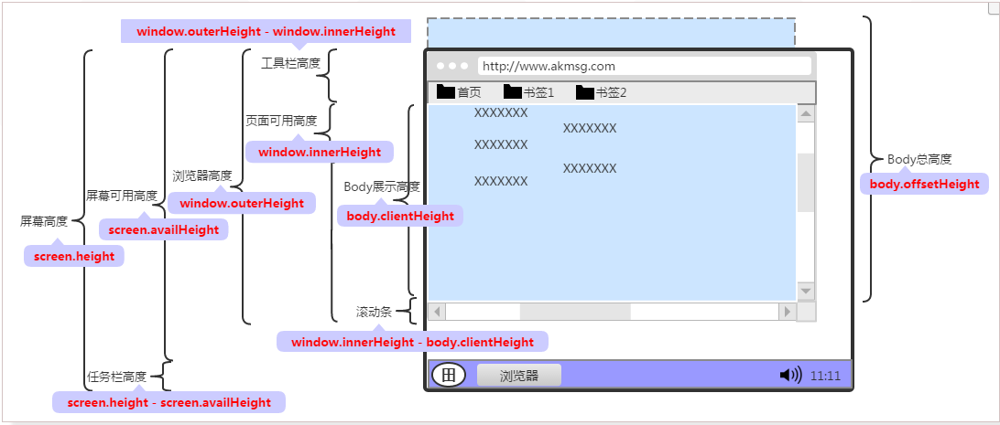

# 浏览器中的宽高问题



* 原生js 不同浏览器有差异（可以使用jq不需要兼容）

## 1、浏览器窗口的宽度/高度(都是可变的)

```js
    //浏览器窗口的宽度，包括滚动条和边框（可变）
    window.outerWidth;
    //浏览器窗口的高度，包括边框、工具栏（可变）
    window.outerHeight;
    //浏览器可视窗口的宽度，不包括边框（可变）
    window.innerWidth;
    //浏览器可视窗口的宽度，不包括边框、工具栏、调试窗口（可变）
    window.innerHeight;
```

## 2、浏览器屏幕的宽度/高度

```js
    //当前浏览器屏幕的宽度（不变）
    window.screen.width;
    //当前浏览器屏幕的高度（不变）
    window.screen.height;

    //浏览器窗口的可用宽度，不包括任务栏（可变）
    window.screen.availWidth;
    //浏览器窗口的可用高度，不包括任务栏（可变）
    window.screen.availHeight;
```

## 3、浏览器距屏幕顶部的高度/宽度

```js
    //浏览器距屏幕顶部的高度（可变），FireFox浏览器中通过screenX获取
    window.screenTop || window.screenY;
    //浏览器距屏幕顶部的宽度（可变），FireFox浏览器中通过screenY获取
    window.screenLeft || window.screenX;
```

## 4、获取document可视区的宽高

```js
    document.body.clientWidth //不包括外边距
    document.body.clientHeight //不包括外边距
    document.documentElement.clientHeight ; //包括外边距
    document.documentElement.clientWidth ; //包括外边距
```

* 在浏览器默认的情况下，`body`有`8-10px`左右的边距，而可见区域包括了这个边距，因此如果我们用到`body{padding:0;margin:0;}`来消除这种默认的情况。那么`document.body.clientWidth`和`document.documentElement.clientWidth`的值就会相同。

## 5、获取内容区域可视区的宽高

```js
    document.body.clientWidth;
    document.body.clientHeight;  //看到的

    document.body.offsetWidth;
    document.body.offsetHeight;  //包括卷上去的
```

## 6、获取内容区域总共的宽高（包括卷上去的和未展示的）

```js
    //网页正文全文宽：
    document.body.scrollWidth
    //网页正文全文高：
    document.body.scrollHeight
```

## 7、获取元素的宽高

```js
    //这种方式只能取到dom元素内联样式所设置的宽高，也就是说如果该节点的样式是在style标签中或外联的CSS文件中设置的话，通过这种方法是获取不到dom的宽高的。
    obj.style.width/height
    //包含border+pdding
    obj.offsetWidth/obj.offstHeight ;
    //包含padding
    obj.clientWidth/obj.clinetHeight ;
    //不包含border和padding  
    window.getComputedStyle('div').width/height ;
```

* 使用getComputedStyle方法获取时需要做兼容[参考此篇](../compatible/getCss.html)

## 8、获取元素的边距

```js
    //包含滚动条的距离
    obj.offsetLeft/obj.offsetTop
```

## 9、获取滚动高的距离

```js
    document.documentElement.scrollTop  //firefox
    document.documentElement.scrollLeft   //firefox

    document.body.scrollTop //IE
    document.body.scrollLeft //IE
```


* jq

## 1、获取浏览器可视区的宽高

```js
    $(window).width()/height() ;
```

## 2、获取元素宽高

```js
    //不包含border和padding
    $("obj").width()/height() ; 
    //包含padding
    $('obj').innerWidth()/innerHeight() ; 
    //包含border和padding
    $('obj').outerWidth([true])/outerHieght([true]) ; //当参数为true的时候 包含margin
```

## 3、获取滚动条的距离

```js
    $(window).scrollTop()/$(window).scrollLeft() ;
```

## 4、获取元素的偏移

```js
    //相对于文档
    $('obj').offset().left/top ;
   //设置新的偏移
    $('obj').offset({
        'left':100,
        'top':200
    })
    //相对于父级
    $('obj').position().left/top ;
```