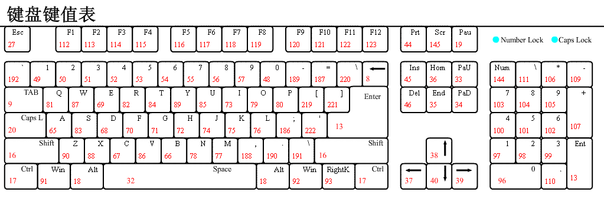

# vue基础

* vue的一句话总结

1. 数据双向绑定可以双向响应视图和数据的变化，特例：vue不能监测数组的length和对象的增加和删除

2. 如果要让视图中的数组发生变化，需要使用数组中的变异方法`push`,`pop`,`shift`,`unshift`,`splice`,`sort`,`reverse`

3. update可以检测数据的变化，但无法监测具体哪一个变化可以使用watch()

4. 如果要在某一个生命周期使用最终的vm实例，可以使用`this.nextTick(()=>{})`

5. create()完成时data,props,computed中的数据都加载完毕

6. vue的data中所有数据公用一个监视器watch，computed中的每一个数据都有一个监视器

7. 使用watch监视数据只能浅层，想要深层监视数据要使用`deep:true`属性,为了发现对象内部值的变化，可以在选项参数中指定 deep: true 。注意监听数组的变动不需要这么做。写法1`vm.$watch('someObject', callback, {deep: true})`写法2 `watch(arr: {hander(){ 需要监听的  },deep:true})`

8. 路由传递路由参数`/article/:page`使用`name: 'articelLink',parms: {page: 1}`,roure-link必须使用`:to={name:'articelLink',parms: {page: 1}}`,不能使用path

## 1、vue 的基本原理

vue 的特征是数据的双向绑定
实现大致过程

```js
let data = {}
let temp = {}

Object.defineProperty(data, 'a', {
  // enumerable: false/true // 定义data.a 是否可以被遍历 默认false
  // configurable: false/true // 定义属性是否被删除 默认false
  // writable: false/true // 定义属性是否被设置 默认false
  // value: 'cdd'  // 设置值
  get() {  // 获取data.a时触发的函数
    return temp.a // 设置中间对象转换，防止设置的时候对自己死循环
  },
  set(value) {
    return temp.a = value
  }
})
```

* 数据双向绑定可以双向响应视图和数据的变化，特例：vue不能监测数组的length和对象的增加和删除

```js
fn() {
  this.a.length = 0; //类似这种操作length的不会监测到
}
```

* 如果要让视图中的数组发生变化，需要使用数组中的变异方法

`push`,`pop`,`shift`,`unshift`,`splice`,`sort`,`reverse`

* 如果要向vm实例中添加双向绑定的数据要使用vm.$set(vm.obj,属性,值) eg:vm.$set(vm.data,'name','cdd')

## 2、vue生命周期

<!--  -->


每一个vue实例必须要经过的四个生命周期

1. beforeCreate vue中没有数据

2. create data中已经有数据了但是数据没有挂在到视图中，数据没有挂在根节点 一般用来请求数据

3. beforeMount 根节点已经存在，但是数据没有挂载到根节点中

4. mount 数据挂载到根节点中了

* 如果要在某一个生命周期使用最终的vm实例，可以使用`this.nextTick(()=>{})`

## 3、vue基本的指令

[参照官网指令](https://cn.vuejs.org/v2/api/#%E6%8C%87%E4%BB%A4)

* 容易混淆的`v-once`和`@click.one`,前者为渲染一次，后者为函数执行一次

### 3.1、[表单修饰符](https://cn.vuejs.org/v2/guide/forms.html)

总是和v-molel一起使用

.lazy
在默认情况下，v-model 在每次 input 事件触发后将输入框的值与数据进行同步 (除了上述输入法组合文字时)。你可以添加 lazy 修饰符，从而转变为使用 change 事件进行同步：

```html
<!-- 在“change”时而非“input”时更新 -->
<input v-model.lazy="msg" >
```

.number
如果想自动将用户的输入值转为数值类型，可以给 v-model 添加 number 修饰符：

```html
<input v-model.number="age" type="number">
```

这通常很有用，因为即使在 type="number" 时，HTML 输入元素的值也总会返回字符串。如果这个值无法被 parseFloat() 解析，则会返回原始的值。

.trim

如果要自动过滤用户输入的首尾空白字符，可以给 v-model 添加 trim 修饰符：

```html
<input v-model.trim="msg">
```

### 3.2、函数fn

函数 `fn` 等价于 `fn($event)` 在方法中可以用`e`来获取`event`, `fn(参数)`则获取不到`event`,同时使用`event`和`参数`要使用`fn($enevt, 参数)`的方式

`fn().enter` 后面可以跟键盘的任意键值
`.stop` 阻止冒泡
`.capture` 为元素绑定捕获阶段触发的回调
`.self`只在自身触发的事件
`.prevent` 阻止默认事件

### 3.3、键值对照表



## 4、vue计算属性cumputed

使用`{ { aDouble } }`就可以在页面中使用

```js
var vm = new Vue({
  data: { a: 1 },
  computed: {
    // 仅读取
    aDouble: function () {
      return this.a * 2
    },
    // 读取和设置
    aPlus: {
      get: function () {
        return this.a + 1
      },
      set: function (v) {
        this.a = v - 1
      }
    }
  }
})
vm.aPlus   // => 2
vm.aPlus = 3
vm.a       // => 2
vm.aDouble // => 4
```

异步的执行

子组件后 create 先 mount
父组件先 create 后 mount
异步更行队列，数据改变不会立即映射，需要获取到最后的数据需要使用$nextTick(()=>{})获取最终数据

插槽

具名和匿名 父插子

```html
<div id="app">
  {{ cdd }}
  <son>
    <p slot="cdd">aaa</p>
  </son>
</div>

<template id="son">
  <div>
    <slot name="cdd"></slot>
    {{ son }}
  </div>
</template>
````

作用域插槽 子插父

1 子组件定义插槽绑定数据

```html
<template id="son">
  <div>
    <slot :cdd="son"></slot>
  </div>
</template>

// son值为son数组
```

2 父组件中定义子组件的模版

```html
<div id="app">
  <son>
    <template slot-scope="result">
      {{ result }}
    </template>
  </son>
</div>

// result就是子组件的数据是一个对象{ "cdd": "son数组" }
```
